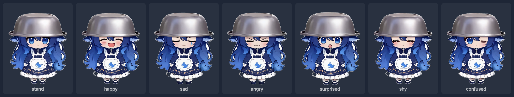

<p align="center">
  
</p>

<h1 align="center">白饭鱼 / BaifanYu</h1>

<p align="center">
  A rice-eating whale girl who lives on your Mac desktop
  <br>
  <b>Native Swift · Offline · No account · MIT code</b>
</p>

<p align="center">
  <i>macOS port of the Android app <a href="https://github.com/LIN428924379/baifanyu">LIN428924379/baifanyu</a></i>
</p>

---

## What she is / 她是什么

She floats on your desktop as a tiny borderless window. Drag her anywhere; drop her at the left or right edge of the screen and she hangs there with only her head showing, so she never blocks what you are looking at. Click her for another expression and a rubber-duck squeak. Right-click (or press and hold) for skin / settings / call her back. When you leave her alone she wanders a little, then rests.

她以一个极小的无边框窗口浮在桌面上。按住她可以拖到任意位置；拖到屏幕左右边缘松手，她会扒在边上、只露一个脑袋，绝不挡住你看的东西。点她一下换一个表情，顺便吱一声（小黄鸭音效）。右键（或长按）弹出「皮肤 / 设置 / 收回」；没人理她的时候她会自己爬两下，然后歇着。

<p align="center">
  
</p>

---

## Features / 功能

- **Floats on top** of every app, on every Space, over full-screen windows
- **Drag** her anywhere — she tilts in the direction you are dragging
- **Perch on a screen edge** — drag her to the left or right edge and let go: she hangs there, head rotated 90°, only her head visible
- **Six expressions** per skin, cycled by clicking her (whole artwork swaps, so no seams)
- **Two skins**: bowl-head (饭盆头) and maid outfit (女仆装)
- **Rubber-duck squeak** on click, three real duck samples, can be switched off
- **Idle wandering** — she crawls around on her own; she stops when you touch, drag, or perch her
- **Three size sliders**: floating height, head width while perched, amount of motion
- **Right-click menu** on her body: skin / next expression / settings / call her back
- **Menu bar resident**, no Dock icon — her face sits in the menu bar
- **Launch at login** support
- **Stops rendering when you cannot see her** (occluded, screens asleep, session locked)
- **Trilingual UI**: English / 简体中文 / 繁體中文 (follows the system or a manual override)
- **100 % offline** — no network code at all: no analytics, no tracking, no account
- **MIT licensed code**, no third-party dependencies

---

- **浮在所有 App 之上**，所有桌面空间、全屏窗口上都在
- **拖拽** —— 拖到哪算哪，拖动时朝拖动方向倾斜
- **扒边** —— 拖到屏幕左右边缘松手，她扒在边上、头旋转 90°、只露一个脑袋
- **每套皮肤 6 个表情**，点她循环切换（整张立绘切换，没有接缝）
- **两套皮肤**：饭盆头 / 女仆装
- **小黄鸭音效**：点击时随机播一个真实鸭叫，可关
- **自动溜达** —— 闲着的时候她自己爬来爬去；碰她、拖她、趴边时不动
- **三档调节**：悬空大小 / 扒边时脑袋宽度 / 动态幅度
- **右键菜单**：皮肤 / 换表情 / 设置 / 收回她
- **菜单栏常驻**，没有 Dock 图标 —— 她的脸就在菜单栏上
- **支持登录时自动启动**
- **看不见她的时候真的停止渲染**（被遮挡、屏幕休眠、会话锁定时）
- **三语界面**：English / 简体中文 / 繁體中文（跟随系统或手动切换）
- **完全离线**：没有任何网络代码，无统计、无追踪、不要账号
- **MIT 开源代码**，无第三方依赖

---

## Requirements / 系统要求

- macOS 14.0 or later / macOS 14.0 或更高版本
- Apple Silicon or Intel / Apple Silicon 或 Intel
- No Xcode needed — Command Line Tools are enough / 无需 Xcode，装了 Command Line Tools 即可

## Build / 构建

```bash
bash build.sh          # → BaifanYu.app
open BaifanYu.app
```

The script builds in release mode, bundles the artwork, sounds and the app icon, and ad-hoc signs the result. `build.sh` also picks a working SDK automatically: on a Command Line Tools-only toolchain the newest SDK declares SwiftUI's property wrappers as macros whose plugin lives only inside Xcode, so the script falls back to the newest SDK where that is not the case.

脚本以 release 模式构建，把立绘、音效、图标全部打进 `BaifanYu.app` 并完成 ad-hoc 签名。`build.sh` 还会自动挑选可用的 SDK：在只装 Command Line Tools 的机器上，最新 SDK 会把 SwiftUI 的属性包装器声明成宏，而宏插件只随 Xcode 提供，所以脚本会自动回退到不启用宏的 SDK。

Extra scripts / 附带脚本:

```bash
swift scripts/gen_icon.swift            # 1024² app icon        → icon-src/AppIcon_1024.png
swift scripts/gen_menubar_icon.swift    # menu bar face (colour) → Sources/Resources/MenuBarIcon.png
swift scripts/gen_expressions.swift     # README montage         → docs/expressions.png
bash scripts/make_dmg.sh                # distributable disk image
```

---

## How to use / 怎么用

1. `open BaifanYu.app` — the first time, the system asks nothing and she simply appears
2. **Hold her and drag** to move her; **drag to the left or right screen edge and let go** to make her hang there
3. **Click her** for another expression (and a squeak)
4. **Right-click her** (or press and hold) for skin / next expression / settings / call her back
5. Her face in the **menu bar** is home base: bring her out or call her back, switch skin, toggle the squeak and the wandering, open **Settings (⌘,)** or **About**
6. Closing the settings window leaves her on your desktop — quit from the menu bar or with **⌘Q**

---

## macOS port notes / 移植说明

The Android original is a foreground service with a `TYPE_APPLICATION_OVERLAY` window. On macOS the equivalent is an **`NSPanel`** with `.nonactivatingPanel`, borderless, transparent, `level = .floating`, `collectionBehavior = [.canJoinAllSpaces, .fullScreenAuxiliary]`. It cannot become key, so clicking her never steals focus from what you are typing in.

Three things from the original's "three hard rules for floating windows" carry over and are implemented:

| Android rule | macOS equivalent |
|---|---|
| The window must hug the pet, never a full-screen transparent layer | the panel is resized to exactly her bounding box, per state |
| The window must be non-focusable | `NSPanel` + `.nonactivatingPanel` + `canBecomeKey = false` |
| Rendering must really stop when invisible | the 60 Hz timer is torn down on occlusion, screen sleep and session lock |

Per-pixel click-through is added on top: a global + local mouse monitor toggles `ignoresMouseEvents` depending on the alpha of the pixel under the pointer, so the transparent margin around her does not swallow clicks meant for the app behind her.

The geometry is a direct port of the Android `PetView` — the same floating bob (`0.022 · amp · sin(2πt/2.4)`), the same breathing squash, the same drag tilt, the same `min(56 pt, width × 25 %)` edge-snap threshold, the same head-only crop while perched, and the same idle-wander numbers (4 pt per 16 ms tick, 0.8 s settle, 1.2–3.6 s rest, 5 s after a touch). `dp` becomes points ~1:1, so the sliders keep their original ranges (120–480 / 56–160 / 30–150 %) and the defaults (240 / 96 / 75 %).

While she hangs on an edge, the same artwork is reused: rotated 90° and cropped to her head, exactly as on Android — no extra "perched" asset is needed.

---

## Project structure / 项目结构

```
Sources/
  App/
    BaifanYuApp.swift        @main, menu bar extra, first-launch dialogs
    AppSettings.swift        UserDefaults-backed settings (same keys & numbers as Android)
    LocalizationManager.swift 三语 UI strings
  Pet/
    PetSkin.swift            the two skins + their head-crop ratios
    PetBitmap.swift          pre-scaled / pre-rotated artwork + alpha hit testing
    PetView.swift            drawing, animation, mouse handling
    PetController.swift      panel, drag, edge snap, perch, wander, menu, sounds
    DuckSound.swift          duck squeak pool (AVAudioPlayer)
  Views/
    MenuBarView.swift        the menu bar dropdown
    SettingsView.swift       the settings window
    AboutWindow.swift        About panel, launch-at-login helper
    BundledImage.swift       resource lookup
  Resources/                 artwork + duck samples + icon
```

---

## Credits & License / 素材与许可

- **Original Android app**: [LIN428924379/baifanyu](https://github.com/LIN428924379/baifanyu) (MIT) — this port reuses its artwork, its interaction design and its animation maths
- **Character**: the DeepSeek-community whale girl; standing art & expressions generated with AI and cut out by the original author
- **Duck squeaks**: [Mixkit](https://mixkit.co/free-sound-effects/duck/) (Mixkit Free License, free for commercial use, no attribution required)
- **Code**: MIT — see [LICENSE](LICENSE)
- **Artwork** (`Sources/Resources/*.png`, `docs/`): community fan art, **not** covered by MIT — personal, non-commercial use only

macOS version © 2026 Du Haoze · 原 Android 应用 © 2026 LIN428924379
